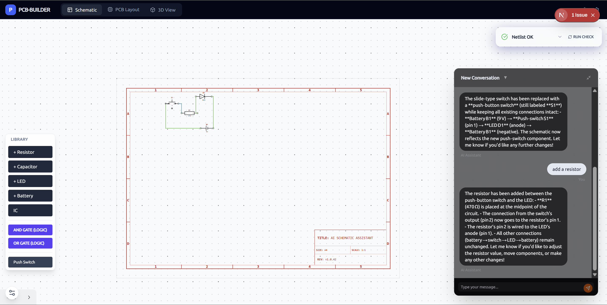

# 🛠️ PCB Builder

An open-source, web-based PCB design suite with a focus on AI assistance and modern web technologies. Build schematics, route traces, and visualize your boards in 3D—all in the browser.



## ✨ Features

- **Intuitive Schematic Editor**: Built with `tldraw` for a smooth, high-performance drawing experience.
- **AI Design Partner**: Integrated AI agent powered by LangGraph to help with component selection, wiring, and automation.
- **Real-time 3D Viewer**: Visualize your PCB in 3D with realistic stackup and component rendering using Three.js.
- **Convex Backend**: Serverless backend for real-time sync and collaboration.
- **Professional-grade Tools**: Schematic ERC (Electrical Rule Check) and DRC (Design Rule Check) support.

## 🚀 Getting Started

### Prerequisites

- **Node.js**: Version 20 or higher.
- **pnpm**: Version 10 or higher.

### Installation

1.  **Clone the repository**:
    ```bash
    git clone https://github.com/subhash131/pcb-builder.git
    cd pcb-builder
    ```

2.  **Install dependencies**:
    ```bash
    pnpm install
    ```

### Environment Setup

You need to configure environment variables for each component:

#### 1. Frontend (`apps/web`)
Copy `.env.example` to `.env` and set your Convex URL:
```bash
cp apps/web/.env.example apps/web/.env
```

#### 2. AI Agent (`apps/agent`)
Copy `.env.example` to `.env` and add your API keys:
```bash
cp apps/agent/.env.example apps/agent/.env
```
*Required: `GROQ_API_KEY` (or OpenAI) and `CONVEX_URL`.*

#### 3. Backend (`packages/backend`)
Environment variables are managed locally by Convex.

### Running the Project

Run the full stack (Web, Agent, and Convex) with a single command:

```bash
pnpm dev
```

This command uses **Turborepo** to launch:
- Next.js development server for the web app.
- Tsx watch mode for the AI agent.
- Convex development server for the backend.

## 📁 Project Structure

```text
├── apps/
│   ├── web/          # Next.js frontend application
│   └── agent/        # LangGraph-powered AI agent
├── packages/
│   ├── backend/      # Convex schema and functions
│   ├── core/         # Shared logic and netlist engine
│   ├── ui/           # Shared UI component library (shadcn/ui)
│   └── ts-config/    # Shared TypeScript configurations
├── turbo.json        # Turborepo configuration
└── pnpm-workspace.yaml
```

## 🛠️ Tech Stack

- **Framework**: Next.js 15 (App Router)
- **Database/Backend**: Convex
- **Canvas/Graphics**: tldraw (2D), Three.js (3D)
- **AI Orchestration**: LangGraph, LangChain
- **Styling**: Tailwind CSS, Framer Motion
- **Tooling**: Turborepo, pnpm, Vitest, Playwright

## 📄 License

This project is licensed under the MIT License.

